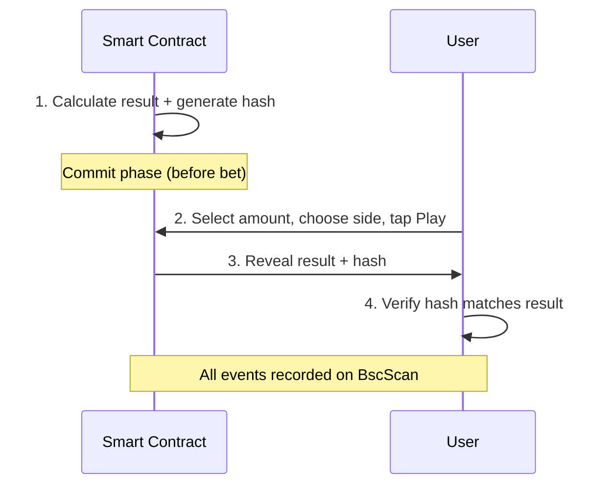

The Arena is the gaming section of the Inkryptus platform. All games use INKY tokens exclusively, and every outcome is recorded on BNB Smart Chain for independent verification.

<Callout kind="info">
  More games are coming soon. Coin Flip is the first Arena game, with additional titles planned for 2026.
</Callout>

## Coin Flip

A simple heads-or-tails game where the user wagers INKY against the platform.

### How it works

<Steps>
  <Step title="Select bet amount" icon="circle" title-type="p">
    Choose one of the fixed bet amounts: 1, 5, 10, 25, 50, or 100 INKY.
  </Step>
  <Step title="Choose your side" icon="target" title-type="p">
    Pick heads or tails.
  </Step>
  <Step title="Result pre-committed" icon="lock" title-type="p">
    Before the user clicks Play, the outcome is already determined by the smart contract and a cryptographic hash of the result is generated. This hash is not yet visible to the user.
  </Step>
  <Step title="Play" icon="play" title-type="p">
    The user taps Play. The bet amount is locked and the game executes.
  </Step>
  <Step title="Result revealed" icon="unlock" title-type="p">
    The outcome and its corresponding hash are revealed together. The user can verify that the hash matches the pre-committed result, confirming the outcome was not altered after the bet was placed.
  </Step>
  <Step title="Payout" icon="wallet" title-type="p">
    Win: wallet credited with 1.9x the bet. Loss: bet amount goes to the platform. The visual experience includes a coin flip animation for a better interface.
  </Step>
</Steps>

### Fairness: commit-reveal scheme

The Arena uses a **commit-reveal scheme** to ensure fair outcomes:

1. **Commit phase:** the smart contract calculates the result and generates a cryptographic hash before the user plays.
2. **Reveal phase:** after the user clicks Play, the result and hash are revealed simultaneously.
3. **Verification:** the user can independently verify that the revealed result matches the pre-committed hash, proving the outcome was determined before the bet was placed and was not manipulated.

All game events are recorded on BNB Smart Chain and can be verified on BscScan.

### Fee and payout structure

A 10% fee is embedded in the win multiplier. The player always sees the net payout (1.9x), never the gross (2.0x).

| Outcome | Player receives | Platform fee | Notes |
| --- | --- | --- | --- |
| **Win** | Bet x 1.9 (original bet + 0.9x profit) | 0.1x of the bet | Fee distributed via 30/70 commission split |
| **Loss** | 0 INKY | 100% of the bet | Full bet goes to the platform |

#### Example: 100 INKY bet, player wins

| Recipient | Amount | Notes |
| --- | --- | --- |
| Player | 190 INKY (1.9x) | Net payout, fee already deducted |
| Platform fee | 10 INKY (0.1x) | Distributed via 30/70 commission split |

The 10 INKY platform fee follows the standard commission distribution (30% Inkryptus, 70% across 7 partner levels). See [Commissions](/partner-program/commissions) for details.

### Fixed bet amounts

All bets use predefined amounts. There are no custom bet values.

| Bet option | Amount |
| --- | --- |
| 1 | 1 INKY |
| 2 | 5 INKY |
| 3 | 10 INKY |
| 4 | 25 INKY |
| 5 | 50 INKY |
| 6 | 100 INKY |

## Betting asset

All Arena games use INKY tokens exclusively. Users cannot play with USDT, BNB, or other assets. This policy applies to all current and future Arena games.

## On-chain verification

<Callout kind="success">
  Every game outcome is recorded on BNB Smart Chain. Results are immutable once confirmed and verifiable by reviewing smart contract events on BscScan.
</Callout>

## Responsible gaming

<Callout kind="danger">
  Arena games are high-risk: the house edge means the expected value for users is negative. Users should understand the fee structure of each game before playing, treat bets as entertainment (not investment), set personal loss limits and stick to them, and avoid chasing losses.
</Callout>

## Related

<Columns cols="3">
  <Card title="Commissions" icon="dollar-sign" href="/partner-program/commissions" horizontal={true}>
    Partner commission structure including Arena fees.
  </Card>
  <Card title="Contracts" icon="file-text" href="/inky-token/contracts" horizontal={true}>
    Smart contract addresses and on-chain verification.
  </Card>
  <Card title="Fees" icon="percent" href="/legal/fees" horizontal={true}>
    Complete fee schedule for all platform operations.
  </Card>
</Columns>

---

<Columns cols="2">
  <Card title="Inkryptus Arena" icon="globe" href="https://inkryptus.com/arena">
    Visit the Arena page on inkryptus.com.
  </Card>
  <Card title="Crypto Games and Provably Fair" icon="book-open" href="https://inkryptus.com/learn/crypto-games-and-provably-fair">
    Learn how on-chain gaming works and what makes it provably fair.
  </Card>
</Columns>
