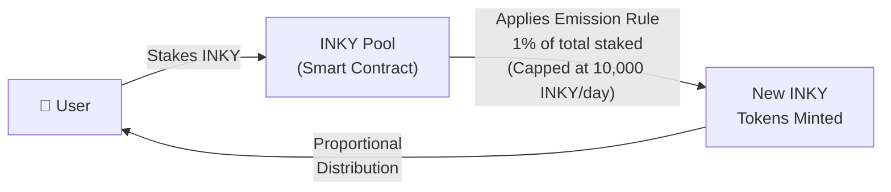

The INKY Pool is the primary staking product of the Inkryptus platform. Users deposit INKY tokens into the staking contract and receive daily rewards generated through scheduled token emission.

## Staking contract

| Field   | Value |
| ------- | ----- |
| Network | BNB Smart Chain |
| Address | [`0x9b8eC6ac014b926201f085e53A0d0540F7C510c5`](https://bscscan.com/address/0x9b8eC6ac014b926201f085e53A0d0540F7C510c5#code) |
| Token   | INKY ([`0x75a320c9...`](https://bscscan.com/address/0x75a320c97205dd2e70e09085d1408c73a73d4d8f)) |
| Minter  | TokenMinter ([`0x68bdab3d...`](https://bscscan.com/address/0x68bdab3dcc5332bcccdc940d54122c155b80857a)) |
| Current staked | Verifiable on [BscScan](https://bscscan.com/address/0x9b8eC6ac014b926201f085e53A0d0540F7C510c5) |

## Plans

| Plan | Lock-up | APR | Daily rate | Status |
| ---- | ------- | --- | ---------- | ------ |
| Flexible (Unlocked) | None | Dynamic | Dynamic | Active |
| 12 months | Yes | Dynamic | Dynamic | Active |
| 36 months | Yes | Dynamic | Dynamic | Active |
| 6 months | Yes | - | - | Discontinued |
| 24 months | Yes | - | - | Discontinued |

<Callout kind="info">
  Discontinued plans are no longer available for new contracts. Existing contracts on those terms continue running until maturity.
</Callout>

APRs are dynamic: they depend on total staked volume and emission conditions. They are displayed in real time in the app.

<Callout kind="tip">
  **Why APR, not APY**: staking rewards do not auto-compound. Users must manually harvest their profit and reinvest it into a new contract if they want to compound. The displayed rate is therefore APR (Annual Percentage Rate), not APY.
</Callout>

## Emission formula

Daily emission follows two simultaneous rules:

1. **Rate**: 1% of the total INKY currently staked across all plans.
2. **Cap**: maximum 10,000 INKY per day, regardless of staked volume.

Whichever is lower applies. Emitted tokens are then distributed among participants.

### Distribution by lock-up tier

The daily emission is not split equally across all plans. Longer lock-up tiers receive a higher share of the daily emission as a business rule: 36-month contracts pay a higher rate than 12-month contracts, which pay more than Flexible. This is by design, as an incentive for longer commitment.

The platform adjusts the allocation between tiers so that longer plans can sustain a higher APR. The total daily emission remains the same (capped at 10,000 INKY), but the per-participant share depends on which plan they chose and how many participants are in each tier.

### Worked examples

<Tabs>
  <Tab title="Below cap" icon="arrow-down">
    **500,000 INKY** staked total:

    | Step | Calculation |
    |------|-------------|
    | 1% of staked | 500,000 x 1% = **5,000 INKY** |
    | Compare with cap | 5,000 < 10,000 |
    | Daily emission | **5,000 INKY**, split proportionally |

    **Implication**: smaller pools yield a higher proportional share per staker.
  </Tab>
  <Tab title="Cap applies" icon="arrow-up">
    **2,000,000 INKY** staked total:

    | Step | Calculation |
    |------|-------------|
    | 1% of staked | 2,000,000 x 1% = **20,000 INKY** |
    | Compare with cap | 20,000 > 10,000 |
    | Daily emission | **10,000 INKY** (cap applies), split proportionally |

    **Implication**: as total staked volume grows, the effective daily rate per INKY decreases.
  </Tab>
</Tabs>

## Performance fee

A **25% performance fee** is applied on staking profit. The fee is collected at the platform level from the rewards distributed to each participant.

- 25% of the profit goes to Inkryptus (operations, liquidity, security).
- 75% of the profit stays with the user.
- No profit in a day means no fee is charged.
- The fee never applies to the staked principal.

## Emission parameters

The emission rate (1%) and daily cap (10,000 INKY) are configurable functions in the staking contract. No emission parameter has been changed since deploy.

<Callout kind="alert">
  The token's hard cap of 200,000,000 INKY is immutable. Even with daily emission, the total supply cannot exceed this cap.
</Callout>

See [INKY Token emission](/inky-token/emission) for the full token-level documentation.

## Contract architecture

The staking pool contract interacts with the INKY token through the **TokenMinter** ([`0x68bdab3d...`](https://bscscan.com/address/0x68bdab3dcc5332bcccdc940d54122c155b80857a)), which manages the whitelist of addresses authorized to call the mint function. See [INKY Token contracts](/inky-token/contracts) for the full architecture.

## Related

<Columns cols="3">
  <Card title="Emission" icon="trending-up" href="/inky-token/emission" horizontal={true}>
    Dual emission rule, daily cap, and minting mechanics.
  </Card>
  <Card title="Lock-up Plans" icon="lock" href="/features/staking/lock-up" horizontal={true}>
    Available contract terms and discontinued plans.
  </Card>
  <Card title="Performance Fee" icon="percent" href="/fees/performance" horizontal={true}>
    25% fee on staking profit: calculation and distribution.
  </Card>
</Columns>
