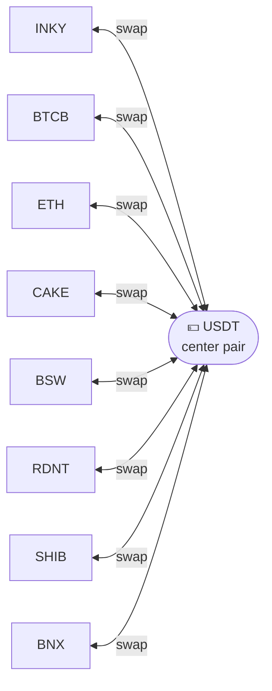
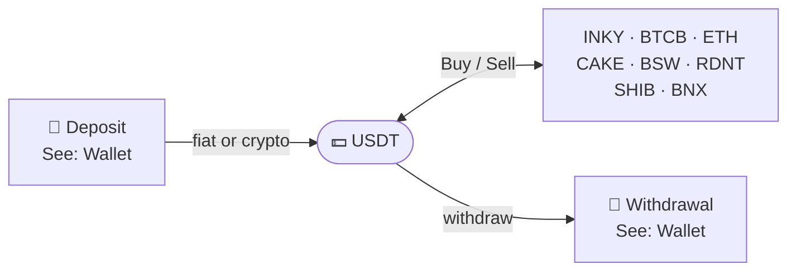

Inkryptus Swap is the internal asset conversion engine. In the app, users see **Buy** and **Sell** actions for each asset, always paired with **USDT as the central currency**. There are no direct routes between non-USDT assets (e.g., INKY→BTCB does not exist). To move between two assets, the user sells one for USDT, then buys the other with USDT.

## How it works

The user navigates to the asset screen inside the app. Two actions are available: **Buy** (USDT→asset) and **Sell** (asset→USDT).

<Steps>
  <Step title="Select asset" icon="circle" title-type="p">
    User opens the asset screen (e.g., INKY, BTCB, ETH). The Buy and Sell options are displayed.
  </Step>
  <Step title="Choose action" icon="arrow-right-left" title-type="p">
    **Buy**: user specifies how much USDT to spend. The app returns a quote showing the amount of the asset to be received.
    **Sell**: user specifies how much of the asset to sell. The app returns a quote showing the USDT to be received.
  </Step>
  <Step title="Review quote" icon="file-text" title-type="p">
    The quote displays: current price, amount in/out, and the applicable fee (shown in both USDT and INKY equivalent). The quote has a short validity window.
  </Step>
  <Step title="Confirm" icon="check-circle" title-type="p">
    User confirms. Execution is internal: no gas fee, no on-chain confirmation wait. The updated balance appears in the wallet immediately.
  </Step>
</Steps>

<Callout kind="info">
  If the price moves beyond the quote validity window, the app requests a new quote before execution. The user always sees the final terms before confirming.
</Callout>

## USDT-centric routing

All operations are structured around USDT as the base currency. This design decision was made to simplify the user experience for non-technical users.

| Route | Example | Steps |
|-------|---------|-------|
| Buy an asset | USDT → INKY | 1 operation |
| Sell an asset | INKY → USDT | 1 operation |
| Move between assets | INKY → BTCB | 2 operations: INKY → USDT, then USDT → BTCB |

Direct routes between non-USDT assets (e.g., INKY→CAKE, ETH→BTCB) are intentionally not supported. Every movement passes through USDT.

## Supported assets

All 8 assets trade through USDT. The USDT itself is the central pair and does not appear as a tradeable asset in the Swap screen.

| Asset | Symbol | Category | Buy (USDT→asset) | Sell (asset→USDT) |
|-------|--------|----------|-------------------|-------------------|
| INKY | INKY | Native token | Yes | Yes |
| Bitcoin (BEP-20) | BTCB | Major | Yes | Yes |
| Ethereum | ETH | Major | Yes | Yes |
| PancakeSwap | CAKE | DeFi | Yes | Yes |
| Biswap | BSW | DeFi | Yes | Yes |
| Radiant | RDNT | DeFi | Yes | Yes |
| Shiba Inu | SHIB | Meme | Yes | Yes |
| BinaryX | BNX | GameFi | Yes | Yes |

All assets operate on BNB Smart Chain (BEP-20).

## Price quoting

The platform provides real-time quotes based on current market data. Key characteristics:

- **Pre-execution visibility**: price, amount, and fee are shown before the user confirms.
- **Validity window**: quotes expire after a short period (typically seconds). If expired, the app generates a new quote automatically.
- **No slippage for the user**: execution happens at the quoted price. The platform absorbs any price movement within the validity window.

## Fees

A fixed fee of **US$3** applies to every swap operation, regardless of the trade amount.

- The fee is displayed in both USDT and INKY equivalent before confirmation.
- The fee is the same whether the user is buying or selling, and applies per operation.
- For multi-step routes (e.g., INKY → USDT → BTCB), the fee applies to each operation (2× US$3 in this example).

See [Fees](/fees/index) for the full fee structure, including commission distribution.

## Related flows

Swap handles only the internal asset conversion. For depositing USDT into your wallet (via external wallet, exchange, or fiat provider), see [Wallet](/features/wallet). For sending assets to an external address, see [Wallet: Withdrawals](/features/wallet#withdrawals).

| Goal | Route | Operations |
|------|-------|------------|
| Enter staking | USDT → INKY (buy) → Staking | 1 buy + 1 stake |
| Realize staking profit | Harvest INKY → INKY → USDT (sell) | 1 harvest + 1 sell |
| Diversify portfolio | USDT → BTCB, USDT → ETH | 1 buy per asset |
| Move between assets | INKY → USDT (sell) → BTCB (buy) | 2 operations |

