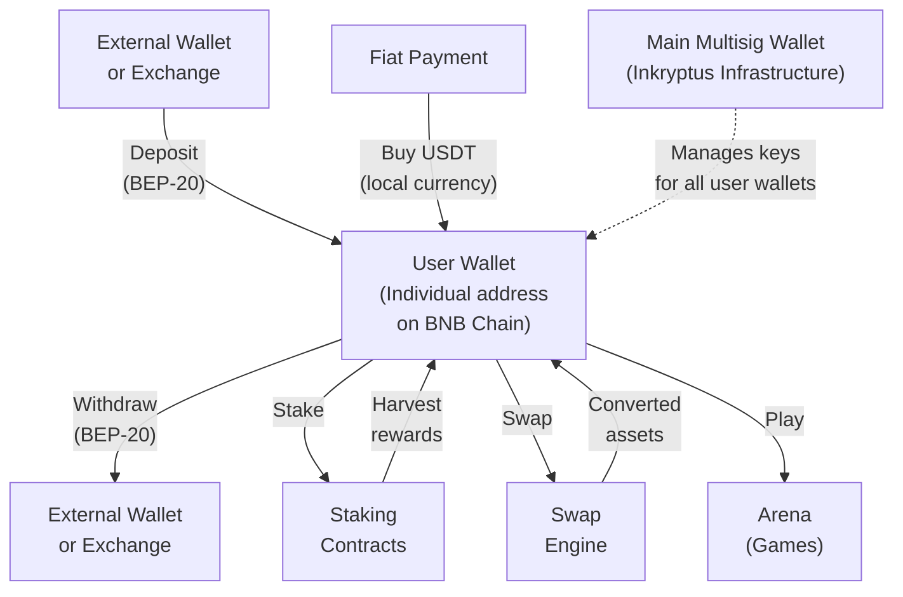

The Inkryptus wallet is a custodial wallet on BNB Smart Chain. Each user receives their own wallet address, managed by the platform's main multisig wallet. Users interact with their assets through the mobile app without generating or storing private keys.

The app has been active since 2020.

## Custodial model

- **Individual user wallets**: Each user has a dedicated wallet address on-chain, generated at account creation.
- **Main multisig management**: All user wallet keys are managed by the platform's main multisig wallet. The specific signature scheme is not publicly disclosed.
- **No private key exposure**: Users never generate, export, or view private keys or seedphrases.
- **Simplified onboarding**: Users create an account and can deposit immediately without key management.

<Callout kind="info">
  The custodial model removes the burden of key recovery but requires users to trust Inkryptus to secure the multisig infrastructure.
</Callout>

## Supported assets

All assets operate on BNB Smart Chain (BEP-20).

| Asset | Symbol | In-app features |
| --- | --- | --- |
| INKY | INKY | Staking, Arena, Swap, fee payment |
| Tether | USDT | Staking, Swap, fiat on-ramp |
| Bitcoin | BTCB | Swap, user holdings |
| Ethereum | ETH | Swap, user holdings |
| PancakeSwap | CAKE | Staking (PancakeSwap protocol) |
| Biswap | BSW | Swap, user holdings |
| Radiant | RDNT | Swap, user holdings |
| Shiba Inu | SHIB | Swap, user holdings |
| BinaryX | BNX | Swap, user holdings |

Each user's wallet address can receive deposits of any BEP-20 standard token, though only the listed assets are supported for staking, trading and in-app features.

New assets are evaluated periodically based on liquidity, utility, security and relevance to the ecosystem.

## Deposit flows

<Tabs>
  <Tab title="From external wallet" icon="download">
    <Steps>
      <Step title="Open deposit screen" icon="circle" title-type="p">
        In the app, go to Wallet and tap Add Funds. Select the asset you want to receive.
      </Step>
      <Step title="Copy your BEP-20 address" icon="copy" title-type="p">
        The app displays your unique deposit address on BNB Smart Chain. Copy it or use the QR Code.
      </Step>
      <Step title="Send from your wallet" icon="send" title-type="p">
        In your external wallet, paste the address and send the crypto on the BEP-20 network.
      </Step>
      <Step title="On-chain confirmation" icon="search" title-type="p">
        The platform detects the incoming transaction once confirmed on BNB Smart Chain. Confirmation is usually fast but may take a few minutes.
      </Step>
      <Step title="Balance credited" icon="check-circle" title-type="p">
        Your app balance updates automatically.
      </Step>
    </Steps>

    <Callout kind="alert">
      Always confirm you are sending on the BEP-20 (BNB Smart Chain) network. Deposits sent on other networks (ERC-20, TRC-20, etc.) cannot be recovered.
    </Callout>
  </Tab>

  <Tab title="From exchange" icon="building">
    <Steps>
      <Step title="Open deposit screen" icon="circle" title-type="p">
        In the app, go to Wallet and tap Add Funds. Select the asset.
      </Step>
      <Step title="Copy your BEP-20 address" icon="copy" title-type="p">
        Copy your deposit address or scan the QR Code.
      </Step>
      <Step title="Initiate withdrawal on the exchange" icon="send" title-type="p">
        In your exchange (e.g., Binance, Coinbase), go to Withdraw, select the asset, paste the Inkryptus address, and choose BEP-20 as the network.
      </Step>
      <Step title="Confirm and wait" icon="search" title-type="p">
        The exchange processes the withdrawal. Once broadcast and confirmed on BNB Smart Chain, Inkryptus detects the transaction.
      </Step>
      <Step title="Balance credited" icon="check-circle" title-type="p">
        Your app balance updates automatically.
      </Step>
    </Steps>
  </Tab>

  <Tab title="Buy with local currency (fiat)" icon="credit-card">
    Buy USDT directly with local currency using an integrated payment provider. Currently available through Simplex, with more providers planned.

    Minimum purchase: US$50. Provider fee: 3.5% (min US$5) + US$0.33 blockchain fee. KYC required.

    <Callout kind="alert">
      Fiat purchases are subject to KYC verification and regional availability. Not all payment methods are available in all jurisdictions.
    </Callout>

    For the full step-by-step flow, fee breakdown, and supported currencies, see [FIAT On-Ramp](/features/wallet/fiat-on-ramp).
  </Tab>
</Tabs>

## Withdrawal flows

<Tabs>
  <Tab title="To external wallet" icon="upload">
    <Steps>
      <Step title="Select asset" icon="circle" title-type="p">
        In the app, go to your wallet, select the asset you want to send, and tap Send.
      </Step>
      <Step title="Enter destination" icon="edit" title-type="p">
        Paste the destination BEP-20 address. Confirm it supports the BEP-20 network.
      </Step>
      <Step title="Confirm amount" icon="file-text" title-type="p">
        Enter the amount. The app shows the applicable fee and the net amount that will arrive.
      </Step>
      <Step title="2FA verification" icon="shield" title-type="p">
        Confirm the transaction via email 2FA.
      </Step>
      <Step title="Transaction broadcast" icon="send" title-type="p">
        The platform signs and broadcasts the transaction to BNB Smart Chain.
      </Step>
      <Step title="Funds arrive" icon="check-circle" title-type="p">
        Once confirmed on-chain, crypto arrives at the destination address. App balance is debited.
      </Step>
    </Steps>
  </Tab>

  <Tab title="To exchange (off-ramp to fiat)" icon="building">
    <Steps>
      <Step title="Convert to USDT" icon="repeat" title-type="p">
        If your balance is in INKY, BTC, ETH or another asset, first convert to USDT using the in-app swap. This is the recommended practice for external transfers.
      </Step>
      <Step title="Send USDT to exchange" icon="send" title-type="p">
        Copy the USDT deposit address from your exchange (e.g., Binance). In the Inkryptus app, select USDT, tap Send, paste the address, and confirm.
      </Step>
      <Step title="Confirm on exchange" icon="check" title-type="p">
        Once the USDT arrives on the exchange, convert to local currency and withdraw using the available method (PIX, SEPA, bank transfer, etc.).
      </Step>
    </Steps>

    <Callout kind="info">
      Some exchanges and wallets do not recognize INKY directly. Converting to USDT before sending avoids compatibility issues.
    </Callout>
  </Tab>
</Tabs>

## Withdrawal limits

Withdrawal limits are defined by KYC tier. The monthly counter resets on the 1st of each month at 00:00:01 UTC.

| Tier | KYC required | Monthly limit |
| --- | --- | --- |
| **Bronze** | No | US$ 500 |
| **Silver** | Yes | US$ 500,000 |

To upgrade from Bronze to Silver, complete the KYC process in Profile, then Account, then KYC inside the app.

<Callout kind="info">
  Individual transactions may also be subject to per-transaction limits and processing delays depending on the asset and amount.
</Callout>

## AML and KYC compliance

Inkryptus integrates anti-money laundering (AML) and know-your-customer (KYC) procedures into the platform.

- **KYC verification**: Users submit identity documents through the app. Verification is processed by a third-party provider and typically completed within a few business days.
- **AML monitoring**: Transactions are monitored for suspicious patterns. The platform may request additional verification or temporarily hold transactions that trigger compliance flags.
- **Tier-based access**: KYC completion unlocks higher withdrawal limits and access to additional features.

## Wallet dashboard

The app provides a unified dashboard for managing all wallet activity.

| Feature | Description |
| --- | --- |
| **Balance overview** | Total value across all assets, with breakdown between free balance and amounts allocated in staking contracts |
| **Daily earnings** | Returns generated by active staking contracts, updated daily |
| **Transaction history** | All movements (deposits, withdrawals, swaps, harvests, commissions) with dates and amounts |
| **Active contracts** | Running staking contracts with invested amount, remaining term, and accumulated return |
| **Asset breakdown** | Individual asset balances with current value in USD |

The dashboard is accessible via the Wallet tab in the app and updates in real time.

## Security model

### Multisig arrangement

The platform uses a multisig wallet to manage user funds. The specific signature scheme is not publicly disclosed. This design:

- Requires multiple signers to approve large transactions, reducing the risk of a single compromised key
- Distributes trust across multiple signing parties
- Allows key rotation without interrupting service

### Additional security measures

| Measure | Description |
|---------|-------------|
| **Two-factor authentication (2FA)** | Email-based verification for sensitive operations (withdrawals, logins) |
| **Rate limiting** | Withdrawal amounts limited by KYC tier (see Withdrawal limits above) |
| **Monitoring** | Platform monitors for suspicious activity and may block transactions or require additional verification |
| **On-chain transparency** | All transactions are recorded on BNB Smart Chain and publicly viewable on BscScan |

### What users cannot do

<Callout kind="alert">
  Because the wallet is custodial, users cannot export or recover private keys, sign transactions directly, use the wallet with external wallet software (WalletConnect, MetaMask, etc.), or take unilateral possession of their funds.
</Callout>

## Account recovery

If a user loses access to their account:

1. Contact support through the app or website.
2. The recovery process requires identity verification (email, KYC documents, or other proof of ownership).
3. Once verified, account access is restored. No seedphrase or private key is needed because all keys are managed by the platform.

<Callout kind="info">
  Account recovery timelines depend on the complexity of the case and the documentation provided. Funds remain secure in the managed wallet during the process.
</Callout>

## Architecture diagram

---

<Columns cols="2">
  <Card title="Deposits FAQ: Common questions about adding funds and balance" icon="help-circle" href="/help-center/faq/deposits">
    Answers to frequently asked questions about deposits and account setup.
  </Card>
  <Card title="Deposits Tutorial: Fiat on-ramp, crypto deposits, and verification" icon="book-open" href="/help-center/tutorials/deposits">
    Learn how to add funds to your Inkryptus wallet.
  </Card>
</Columns>

## Related

<Columns cols="3">
  <Card title="Fee Table" icon="table" href="/fees/fee-table" horizontal={true}>
    Complete fee schedule for deposits, withdrawals, and swaps.
  </Card>
  <Card title="Architecture" icon="layers" href="/introduction/architecture" horizontal={true}>
    Platform infrastructure and on-chain design.
  </Card>
  <Card title="Staking" icon="trending-up" href="/features/staking/index" horizontal={true}>
    Stake assets from your wallet balance.
  </Card>
</Columns>

---

<Columns cols="2">
  <Card title="Inkryptus Wallet" icon="globe" href="https://inkryptus.com/wallet">
    Visit the wallet page on inkryptus.com.
  </Card>
  <Card title="Crypto Wallets for Beginners" icon="book-open" href="https://inkryptus.com/learn/crypto-wallet-for-beginners">
    Learn what crypto wallets are and how they keep your assets safe.
  </Card>
</Columns>
