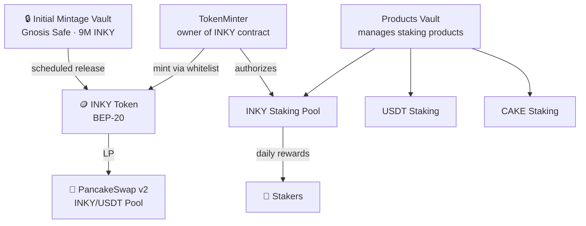

All Inkryptus contracts follow OpenZeppelin standards and have verified source code on BscScan. Critical functions (mint, burn, transferOwnership, deposit, withdraw) are restricted to the owner address and publicly verifiable on-chain.

Platform modules (wallet, swap, vaults) operate independently, ensuring on-chain traceability and continuous operational security.

## Core contracts

### INKY Token (main contract)

Main contract responsible for minting, transferring, and burning INKY tokens.

| Field    | Value                                                                                                                       |
| -------- | --------------------------------------------------------------------------------------------------------------------------- |
| Network  | BNB Smart Chain                                                                                                             |
| Standard | BEP-20                                                                                                                      |
| Address  | [`0x75a320c97205dd2e70e09085d1408c73a73d4d8f`](https://bscscan.com/address/0x75a320c97205dd2e70e09085d1408c73a73d4d8f#code) |
| Verified | Yes                                                                                                                         |
| Hard cap | 200,000,000 INKY (immutable)                                                                                                |

### TokenMinter

Gatekeeper contract that manages which addresses are authorized to call the INKY token's mint function. Deployed on October 31, 2023.

| Field   | Value                                                                                                                  |
| ------- | ---------------------------------------------------------------------------------------------------------------------- |
| Network | BNB Smart Chain                                                                                                        |
| Address | [`0x68bdab3dcc5332bcccdc940d54122c155b80857a`](https://bscscan.com/address/0x68bdab3dcc5332bcccdc940d54122c155b80857a) |

### INKY Staking Pool

Staking contract responsible for the daily emission of up to 1% of the total staked amount, distributed proportionally among participants.

| Field   | Value                                                                                                                       |
| ------- | --------------------------------------------------------------------------------------------------------------------------- |
| Network | BNB Smart Chain                                                                                                             |
| Address | [`0x9b8eC6ac014b926201f085e53A0d0540F7C510c5`](https://bscscan.com/address/0x9b8eC6ac014b926201f085e53A0d0540F7C510c5#code) |

## Vaults

### Initial Mintage Vault

Vault responsible for custodying the 10,000,000 INKY from the initial mint, releasing them according to the Inkryptus economic plan.

| Field   | Value                                                                                                                       |
| ------- | --------------------------------------------------------------------------------------------------------------------------- |
| Network | BNB Smart Chain                                                                                                             |
| Address | [`0x19d24adf08d2c169667353957adb02e7aa4127a9`](https://bscscan.com/address/0x19d24adf08d2c169667353957adb02e7aa4127a9#code) |

### Products Vault

Vault responsible for managing the smart contracts for Staking and Yield Farming products.

| Field   | Value                                                                                                                  |
| ------- | ---------------------------------------------------------------------------------------------------------------------- |
| Network | BNB Smart Chain                                                                                                        |
| Address | [`0xa307cf9e07692e7a31d0b42b970c180f3a2296ee`](https://bscscan.com/address/0xa307cf9e07692e7a31d0b42b970c180f3a2296ee) |

### Inkryptus Vault

Institutional vault of the platform.

| Field   | Value                                                                                                                       |
| ------- | --------------------------------------------------------------------------------------------------------------------------- |
| Network | BNB Smart Chain                                                                                                             |
| Address | [`0x2606F6eD697280BCA6deF66da390E4FeeE5b4F06`](https://bscscan.com/address/0x2606F6eD697280BCA6deF66da390E4FeeE5b4F06#code) |

### UniversalConversionVault

Manages token conversions and staking operations with configurable daily conversion limits per token. Currently holds ~114,727 INKY.

| Field   | Value                                                                                                                  |
| ------- | ---------------------------------------------------------------------------------------------------------------------- |
| Network | BNB Smart Chain                                                                                                        |
| Address | [`0xbf2ae077e85e43198a84903fc0af1ba4b2dcdefc`](https://bscscan.com/address/0xbf2ae077e85e43198a84903fc0af1ba4b2dcdefc) |

## Platform operations

### Liquidity Pool (PancakeSwap)

Official INKY liquidity pair on PancakeSwap, used for price formation and decentralized swaps (INKY/USDT). This contract belongs to the PancakeSwap DEX and is publicly traceable on-chain.

| Field   | Value                                                                                                                       |
| ------- | --------------------------------------------------------------------------------------------------------------------------- |
| Network | BNB Smart Chain                                                                                                             |
| Pair    | INKY / USDT                                                                                                                 |
| DEX     | PancakeSwap v2                                                                                                              |
| Address | [`0xe3a00d1a031c505446b028956edc9e0768a11376`](https://bscscan.com/address/0xe3a00d1a031c505446b028956edc9e0768a11376#code) |

### Platform Wallet

Contract responsible for creating the user's personal wallet and managing fund movements within the platform.

| Field   | Value                                                                                                                       |
| ------- | --------------------------------------------------------------------------------------------------------------------------- |
| Network | BNB Smart Chain                                                                                                             |
| Address | [`0x6A08EfFc4bF11E369c0C7DB00A5cc18Dd9776F26`](https://bscscan.com/address/0x6A08EfFc4bF11E369c0C7DB00A5cc18Dd9776F26#code) |

### Swap

Contract responsible for swap operations within the platform.

| Field   | Value                                                                                                                       |
| ------- | --------------------------------------------------------------------------------------------------------------------------- |
| Network | BNB Smart Chain                                                                                                             |
| Address | [`0x7E1E330E5f2fa0618F3E5449AE3B3C29b73fA864`](https://bscscan.com/address/0x7E1E330E5f2fa0618F3E5449AE3B3C29b73fA864#code) |

### UniversalExchange

Swap contract enabling token exchanges with slippage protection.

| Field   | Value                                                                                                                  |
| ------- | ---------------------------------------------------------------------------------------------------------------------- |
| Network | BNB Smart Chain                                                                                                        |
| Address | [`0x3e3a5a21b270b2f84bf4c6e4503f704bb085f673`](https://bscscan.com/address/0x3e3a5a21b270b2f84bf4c6e4503f704bb085f673) |

### PaymentWallet

Multi-signature payment processing contract requiring multiple processor approvals before releasing funds.

| Field   | Value                                                                                                                  |
| ------- | ---------------------------------------------------------------------------------------------------------------------- |
| Network | BNB Smart Chain                                                                                                        |
| Address | [`0x7114369715D19167754fD2714099BF7DF0007323`](https://bscscan.com/address/0x7114369715D19167754fD2714099BF7DF0007323) |

## Administration

<Callout kind="info">
  The current **owner of the INKY token contract is the TokenMinter** ([`0x68bdab3dcc5332bcccdc940d54122c155b80857a`](https://bscscan.com/address/0x68bdab3dcc5332bcccdc940d54122c155b80857a)), not an EOA. This means minting can only happen through the TokenMinter's controlled minter whitelist.
</Callout>

The TokenMinter provides `updateMinters()` to manage the whitelist and `transferTokenOwnership()` to transfer ownership of the INKY contract itself.

The Initial Mintage Vault ([`0x19d24adf...`](https://bscscan.com/address/0x19d24adf08d2c169667353957adb02e7aa4127a9)) is a **Gnosis Safe** (multisig) proxy contract using Safe Singleton L2 v1.3.0, holding 9,000,000 INKY. Fund movements from this vault require multiple signatures.

All admin-restricted functions are visible and verifiable directly on BscScan through each contract's verified source code.
