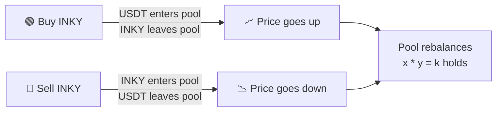

{/* IMAGE SUGGESTION: Screenshot or embed of GeckoTerminal/DEX Screener showing the INKY/USDT pair with price chart and pool depth. Alternatively, a clean diagram showing liquidity flow: User → App Swap or PancakeSwap → INKY/USDT Pool. */}

## Pricing mechanism

INKY is priced through an Automated Market Maker (AMM) on PancakeSwap v2. There is no order book and no centralized price feed. The price emerges directly from the ratio of assets in the liquidity pool.

### How AMM pricing works

PancakeSwap v2 uses the **constant product formula**:

**x * y = k**

Where **x** is the INKY reserve in the pool, **y** is the USDT reserve, and **k** is a constant that only changes when liquidity is added or removed. The spot price of INKY at any moment equals the ratio of USDT to INKY in the pool:

**Price (INKY/USDT) = USDT reserve / INKY reserve**

When a trader buys INKY, they add USDT to the pool and remove INKY. This shifts the ratio and increases the price. When a trader sells INKY, the opposite happens: INKY enters the pool, USDT leaves, and the price decreases.

### Price impact and slippage

Every trade moves the price. The size of that movement (price impact) depends on the trade size relative to the pool depth. Larger trades relative to the pool produce larger price shifts. Deep liquidity means smaller price impact per trade, which results in tighter spreads and more stable pricing.

<Callout kind="info">
  The in-app Swap quotes a price derived from the on-chain pool state. The quoted price already accounts for any applicable spread. Users trading via the app do not interact with the AMM directly; the platform executes the conversion internally.
</Callout>

### Two trading venues

INKY can be traded in two ways, both referencing the same liquidity pool:

| Venue | How it works | Who uses it |
| --- | --- | --- |
| **In-app Swap** | Platform executes internally. Fixed US$3 fee, no gas fee for the user. Price derived from pool state. | Most users |
| **PancakeSwap (direct)** | User connects an external wallet and swaps on-chain. Standard PancakeSwap fees (0.25%) and BNB gas apply. | Advanced users, external traders |

Both venues draw from the same INKY/USDT pool, so price discovery is unified.

## Primary pair

INKY trades against USDT on PancakeSwap v2. This is the only active liquidity pair.

| Field        | Value                                                                                                                       |
| ------------ | --------------------------------------------------------------------------------------------------------------------------- |
| Pair         | INKY / USDT                                                                                                                 |
| DEX          | PancakeSwap v2                                                                                                              |
| Network      | BNB Smart Chain                                                                                                             |
| Pool address | [`0xe3a00d1a031c505446b028956edc9e0768a11376`](https://bscscan.com/address/0xe3a00d1a031c505446b028956edc9e0768a11376#code) |
| Created      | May 17, 2023 at 18:36:19 UTC                                                                                                |
| Creation tx  | [`0x755859ef...`](https://bscscan.com/tx/0x755859ef719acd5668b74c40d8fcbc1df7a9712550c8cbc7906d1f7536a1861e)                |
| Created by   | [`0xa307cf9e...`](https://bscscan.com/address/0xa307cf9e07692e7a31d0b42b970c180f3a2296ee) (Products Vault)                  |

**Live data**:

<Columns cols="3">
  <Card title="GeckoTerminal" icon="bar-chart-2" href="https://www.geckoterminal.com/bsc/pools/0xe3a00d1a031c505446b028956edc9e0768a11376" horizontal={true}>
    Price chart and pool analytics.
  </Card>
  <Card title="DEX Screener" icon="search" href="https://dexscreener.com/bsc/0xe3a00d1a031c505446b028956edc9e0768a11376" horizontal={true}>
    Real-time trading data.
  </Card>
  <Card title="PancakeSwap" icon="repeat" href="https://pancakeswap.finance/swap?outputCurrency=0x75a320c97205dd2e70e09085d1408c73a73d4d8f" horizontal={true}>
    Swap interface.
  </Card>
</Columns>

## Current liquidity

Current pool depth is publicly verifiable via the links above (GeckoTerminal, DEX Screener, PancakeSwap).

Live value: `[rtd_inky type="liquidity_usd"]` {/* RTD widget mock, replace with real shortcode when available */}

## LP token status

<Callout kind="alert">
  The liquidity provided to the pool is **not locked** via an external mechanism (Team.Finance, Unicrypt, PinkSale, etc.).
</Callout>

The vast majority of LP tokens are held by the Products Vault ([`0xa307cf9e...`](https://bscscan.com/address/0xa307cf9e07692e7a31d0b42b970c180f3a2296ee)). Current distribution is verifiable on BscScan at the pool address above.

## Other venues

There are no secondary liquidity pools and no CEX listings at this time. INKY trades exclusively on PancakeSwap v2.

## Related

<Columns cols="3">
  <Card title="Swap" icon="repeat" href="/features/swap" horizontal={true}>
    In-app swap mechanics, fixed fee, and supported pairs.
  </Card>
  <Card title="Token Identity" icon="tag" href="/inky-token/overview" horizontal={true}>
    Contract address, network, and verification steps.
  </Card>
  <Card title="Risks" icon="alert-triangle" href="/introduction/risks" horizontal={true}>
    Liquidity risk, slippage, and pool depth considerations.
  </Card>
</Columns>

---

<Card title="AMM and Liquidity Pools" icon="book-open" href="https://inkryptus.com/learn/amm-and-liquidity-pools">
  Learn how automated market makers work and why liquidity matters.
</Card>
