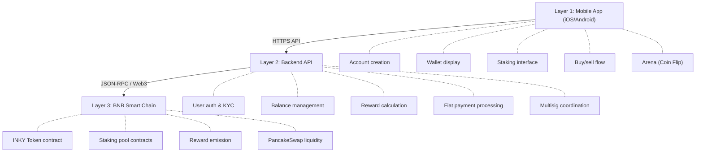

This page describes the technical architecture of Inkryptus across three layers: mobile application (frontend), backend API, and blockchain infrastructure.

## Three-layer architecture

## Layer 1: Mobile application

The Inkryptus app runs on iOS and Android. Users interact with:

- **Account setup**: Create an account with email or phone, verify identity (KYC).
- **Wallet view**: See custodial wallet balance, transaction history, and asset breakdown.
- **Staking interface**: Deposit into INKY, USDT, or CAKE pools, view accrued rewards, claim or compound.
- **Buy and sell**: Purchase crypto with fiat or sell crypto for cash via ACH/bank transfer.
- **Arena**: Participate in Coin Flip game, place bets, view results.
- **Profile and settings**: Update KYC info, manage 2FA, view account security.

<Callout kind="info">
  The app communicates exclusively with the backend API via HTTPS. No direct blockchain interaction happens from the client.
</Callout>

## Layer 2: Backend API

The backend handles all business logic:

| Function | Description |
|----------|-------------|
| **Authentication** | User login, session management, 2FA verification |
| **KYC and compliance** | Identity verification, sanction checks, AML screening |
| **Balance ledger** | Off-chain tracking of user balances, backed by on-chain multisig wallet |
| **Reward calculation** | Tracks staking rewards accrual per user per pool |
| **Deposit processing** | Monitors incoming blockchain transactions, credits user balances |
| **Withdrawal requests** | Validates against KYC and limits, triggers multisig transactions |
| **Fiat payment** | Integrates with payment processors for buy/sell flows |
| **Multisig coordination** | Constructs and submits multisig transactions to signing authorities |

<Callout kind="alert">
  The backend is not fully decentralized; it is operated by Inkryptus and serves as the single source of truth for user balances and account state.
</Callout>

## Layer 3: Blockchain (BNB Smart Chain)

All token mechanics and staking logic is on-chain and publicly verifiable.

### Custodial wallet architecture

<Steps>
  <Step title="Account creation" icon="user-plus" title-type="p">
    When a user creates an account, the platform generates an individual wallet address for them.
  </Step>
  <Step title="Key management" icon="key" title-type="p">
    The keys for all user wallets are managed by the platform's main multisig wallet.
  </Step>
  <Step title="Deposit routing" icon="download" title-type="p">
    Each user's wallet address is unique and can receive deposits directly.
  </Step>
  <Step title="Withdrawal authorization" icon="shield" title-type="p">
    When a user withdraws, the backend constructs a multisig transaction to authorize the transfer from the user's managed wallet to their external address.
  </Step>
</Steps>

This model means:

- Each user has a dedicated on-chain wallet address.
- Users do not manage seedphrases or private keys.
- Deposits go directly to the user's assigned address.
- Withdrawals require multisig coordination, which may introduce latency.
- Users must trust the platform as a custodian; the main multisig controls all wallet keys.

### Smart contracts

#### INKY Token (BEP-20)

| Field | Value |
|-------|-------|
| Contract | `0x75a320c97205dd2e70e09085d1408c73a73d4d8f` |
| Network | BNB Smart Chain |
| Standard | BEP-20 |
| Decimals | 18 |
| Supply | Hard cap of {{RTD:total_supply}} tokens |
| Status | Public, verifiable on [BscScan](https://bscscan.com/token/0x75a320c97205dd2e70e09085d1408c73a73d4d8f) |

The INKY token is a standard BEP-20 contract with administrative functions for minting and burning. It is the reward token for staking pools.

#### Staking Pool (INKY)

The INKY staking pool contract accepts INKY deposits and allocates rewards. Users deposit INKY, earn INKY rewards from the TokenMinter, and can claim or auto-compound. Pool mechanics and parameters are detailed in [Staking](/products/staking/inky-pool).

#### TokenMinter

The TokenMinter contract emits INKY rewards according to a programmed schedule. It is a time-based contract that calculates how many tokens should be minted per block and distributes them to the staking pool.

#### USDT and CAKE pools

Similar pool contracts exist for USDT and CAKE staking. These contracts interact with the PancakeSwap ecosystem for liquidity and reward sourcing.

#### Game contract (Coin Flip)

The Coin Flip game contract manages bets, outcomes, and payouts. Details are in [Arena](/products/arena).

<Callout kind="tip">
  All contract source code is viewable on BscScan. See [Contracts](/inky-token/contracts) for all addresses.
</Callout>

### Liquidity and trading

| Pool | Pair | Platform | Fee |
|------|------|----------|-----|
| INKY primary | INKY/USDT | PancakeSwap v2 | 0.25% (standard) |

This pool allows users and arbitrageurs to trade INKY against USDT at market rates. Liquidity depth affects slippage. The platform may add or remove liquidity at its discretion.

## Security model

### Key separation

| Key type | Holder | Purpose |
|----------|--------|---------|
| **User-facing keys** | None | Users authenticate via email or phone + 2FA |
| **Multisig keys** | Infrastructure providers / platform operators | No single entity holds all keys |
| **Smart contract keys** | Contract owner via multisig | Admin functions controlled by multisig |

This model eliminates seedphrase exposure but requires users to trust the platform's key management practices.

### On-chain verification

All contract code, balances, and transactions are public on BscScan. Partners and auditors can verify: token supply and holder balances, staking pool deposits and reward rates, liquidity on PancakeSwap, and transaction history and gas costs.

### Third-party security tools

Inkryptus smart contracts are subject to third-party scanner results (e.g., BscScan security checks). No formal audit claim is made. Security analysis should be based on public code review and scanner reports.

### Platform security practices

The platform implements:

- **Two-factor authentication (2FA)** for user accounts
- **Multisig wallet control** for all on-chain transactions
- **API rate limiting and DDoS protection**
- **Regular security audits** of backend infrastructure (not published)

## Data flow example: User stakes INKY

<Steps>
  <Step title="Open staking" icon="circle" title-type="p">
    User opens Inkryptus app and selects "Stake INKY".
  </Step>
  <Step title="Approve action" icon="check" title-type="p">
    User approves staking action in the app.
  </Step>
  <Step title="API request" icon="send" title-type="p">
    App sends HTTPS request to backend: `POST /staking/inky/deposit` with amount and user auth token.
  </Step>
  <Step title="Backend validation" icon="shield" title-type="p">
    Backend validates user balance (off-chain ledger) and checks KYC status.
  </Step>
  <Step title="Transaction construction" icon="code" title-type="p">
    Backend constructs a blockchain transaction: transfer INKY from the user's managed wallet to the staking pool contract.
  </Step>
  <Step title="Multisig signing" icon="key" title-type="p">
    Backend signs the transaction using multisig authorization.
  </Step>
  <Step title="Broadcast" icon="radio" title-type="p">
    Transaction is broadcast to BNB Smart Chain and confirmed.
  </Step>
  <Step title="On-chain confirmation" icon="check-circle" title-type="p">
    Backend monitors the on-chain staking pool contract and confirms the deposit was recorded.
  </Step>
  <Step title="Ledger update" icon="database" title-type="p">
    Backend updates the user's balance ledger to reflect the INKY moved to staking.
  </Step>
  <Step title="Reward tracking" icon="trending-up" title-type="p">
    Backend begins tracking reward accrual for that user in the staking pool.
  </Step>
  <Step title="Confirmation displayed" icon="monitor" title-type="p">
    App shows "INKY staked" and displays accrued rewards in real time (fetched from backend).
  </Step>
</Steps>

## Infrastructure summary

| Component | Responsibility | Custodial | Public |
|-----------|---------------|-----------|--------|
| Mobile app | UI/UX, user input | No | Yes (app store) |
| Backend API | Balance management, KYC, multisig | Yes | No |
| INKY token | BEP-20 supply, transfers | No | Yes (BscScan) |
| Staking pools | Reward accrual, claims | No | Yes (BscScan) |
| Main multisig | Manage keys for all user wallets | Yes | Partially |
| Multisig | Authorize withdrawals | Yes | Yes (transactions public) |

{/* IMAGE SUGGESTION: Three-layer architecture diagram showing mobile app, API layer, and blockchain layer with arrows showing data flow. */}

{/* IMAGE SUGGESTION: Custodial wallet architecture diagram showing main multisig wallet managing individual user wallet addresses, with deposit and withdrawal flows per user. */}
