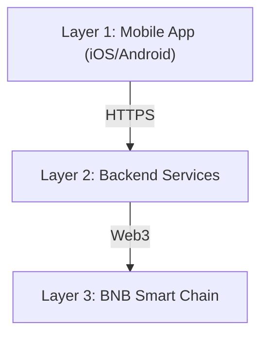

This page describes the high-level architecture of Inkryptus across three layers: mobile application, backend services, and blockchain infrastructure.

## Three-layer architecture

### Layer 1: Mobile application

The Inkryptus app runs on iOS and Android. Users interact with all platform products through the app: wallet, staking, swap, Arena, and Partner Program. The app communicates exclusively with the backend via HTTPS.

### Layer 2: Backend services

The backend handles business logic including user authentication, KYC compliance, balance management, and coordination of on-chain transactions. It serves as the bridge between the user interface and the blockchain.

<Callout kind="info">
  The backend is operated by Inkryptus and serves as the coordination layer between user actions and on-chain execution.
</Callout>

### Layer 3: Blockchain (BNB Smart Chain)

All token mechanics, staking logic, and game outcomes are recorded on BNB Smart Chain and publicly verifiable.

Key on-chain components:

- **INKY Token**: BEP-20 contract with a hard cap of 200,000,000 tokens.
- **Staking pools**: Contracts managing deposits, reward accrual, and claims for INKY, USDT, and CAKE.
- **TokenMinter**: Emits INKY rewards according to the programmed emission schedule.
- **Game contracts**: Manage bets, outcomes, and payouts for Arena games.
- **PancakeSwap liquidity**: INKY/USDT pair for open-market trading.

See [Contracts](/inky-token/contracts) for all contract addresses.

## Custodial wallet model

When a user creates an account, the platform generates an individual wallet address on BNB Smart Chain. Each user has their own on-chain address. All wallet keys are managed by the platform's multisig infrastructure.

This means:

- Users do not manage seedphrases or private keys.
- Deposits go directly to the user's assigned address.
- Withdrawals are authorized through the platform's multisig process.
- Users must trust the platform as a custodian.

See [Wallet](/features/wallet) for deposit and withdrawal flows.

## Security overview

| Measure | Description |
|---------|-------------|
| **Multisig wallet** | All on-chain transactions require multiple signatures |
| **Two-factor authentication** | Email-based 2FA for sensitive operations |
| **KYC and AML compliance** | Identity verification and transaction monitoring |
| **On-chain transparency** | All contracts and transactions are public on BscScan |

<Callout kind="tip">
  All contract source code is viewable on BscScan. See [Contracts](/inky-token/contracts) for addresses and verification links.
</Callout>

## Related

<Columns cols="3">
  <Card title="Security & Verification" icon="shield" href="/introduction/security" horizontal={true}>
    Security measures, audit status, and verification steps.
  </Card>
  <Card title="Contracts" icon="file-text" href="/inky-token/contracts" horizontal={true}>
    Contract addresses and BscScan verification links.
  </Card>
  <Card title="Token Security" icon="lock" href="/inky-token/security" horizontal={true}>
    Token-level security: mint controls, ownership, and permissions.
  </Card>
</Columns>
