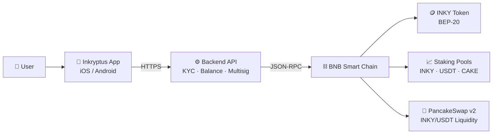

<Callout kind="info">
  **Audience**: partners, integrators, investors, auditors, security researchers.
  This documentation is not indexed in SEO (GitBook with robots blocked) and serves as the source of truth for platform architecture, custodial model, smart contract addresses, and system design.
</Callout>

## What is Inkryptus

Inkryptus is a custodial cryptocurrency platform deployed on BNB Smart Chain. Users manage crypto assets and earn staking rewards through a mobile application without handling private keys or seedphrases. The platform infrastructure consists of three layers: a mobile frontend, backend API, and on-chain smart contracts centered around the INKY token (BEP-20 standard).

The platform has been active since late 2020, initially operating with encapsulated PancakeSwap staking to simplify DeFi access for users. In May 2023, the INKY token was deployed on BNB Smart Chain, expanding the ecosystem with native staking pools, on-chain games, and a unified utility token. Inkryptus operates a custodial wallet architecture where a main multisig wallet manages individual user wallets, each with its own address. All staking pools, token mechanics, and liquidity arrangements are maintained on-chain and publicly verifiable on BscScan.

## Who this documentation is for

<Columns cols="2">
  <Card title="Partners and Integrators" icon="handshake" href="/features/index">
    API details, contract interaction points, and wallet mechanics.
  </Card>
  <Card title="Investors and Auditors" icon="search" href="/inky-token/index">
    Token supply, emission, smart contract code, and fee structures.
  </Card>
  <Card title="Technical Users" icon="code" href="/introduction/architecture">
    System architecture and on-chain processes.
  </Card>
  <Card title="Security Researchers" icon="shield" href="/inky-token/security">
    Contract code, multisig arrangements, and threat models.
  </Card>
</Columns>

## What you will find here

<Columns cols="2">
  <Card title="How Inkryptus Works" icon="zap" href="/introduction/how-it-works" horizontal={true}>
    Custodial model, product suite, deposit flow, and reward mechanisms.
  </Card>
  <Card title="Platform Architecture" icon="layers" href="/introduction/architecture" horizontal={true}>
    System layers, wallet design, smart contracts, and security model.
  </Card>
  <Card title="INKY Token" icon="coins" href="/inky-token/index" horizontal={true}>
    Supply, emission, liquidity, and security details.
  </Card>
  <Card title="Features" icon="grid" href="/features/index" horizontal={true}>
    Staking pools, buy/sell mechanics, and Arena games.
  </Card>
</Columns>

## Key facts

| Aspect | Value |
|--------|-------|
| Platform type | Custodial crypto platform, BEP-20 token (INKY) |
| Blockchain | BNB Smart Chain |
| Active since | Late 2020 (INKY token deployed May 11, 2023) |
| Key token | INKY (BEP-20) |
| Products | Staking (INKY, USDT, CAKE), buy/sell, Arena |
| Wallet model | Main multisig manages individual user wallets, no seedphrase exposure |
| Verification | All contracts public and verifiable on BscScan |
| Reputation | [4.4★ on Trustpilot](https://www.trustpilot.com/review/inkryptus.com) |

<Callout kind="alert">
  This documentation reflects the state of smart contracts and platform operations as of the date of publication. No audit claims are made. Contract security is subject to third-party scanner results and public code review on BscScan. Users and partners should perform their own technical due diligence.
</Callout>

---

<Card title="Help Center" icon="help-circle" href="/help-center/faq/platform">
  Looking for step-by-step guides or answers to common questions? Visit the Help Center.
</Card>
