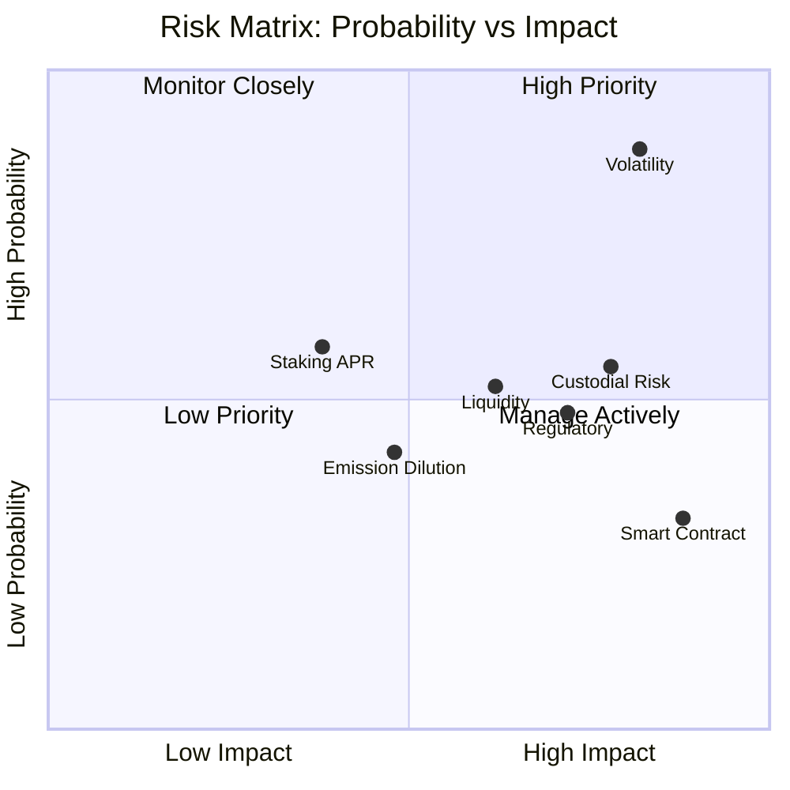

This document outlines the key risks users and partners should understand before using the Inkryptus platform.

<Callout kind="danger">
  Cryptocurrency assets carry inherent financial risk. Users may lose part or all of their invested capital. This documentation is informational only and does not constitute investment advice.
</Callout>

## Price volatility

Cryptocurrency assets are subject to rapid and significant price fluctuations. The value of INKY, USDT, BTC, ETH, BNB, CAKE, and all other digital assets can increase or decrease substantially within short periods.

- Users may lose part or all of their invested capital.
- Platform-quoted prices may change between quote generation and transaction execution.
- External market conditions (exchange listings, regulatory announcements, macroeconomic factors) can cause sharp price movements.

**Mitigation:** The platform supports stablecoin holdings (USDT) for users who want reduced volatility exposure. The in-app Swap executes at the quoted price with no slippage for the user. Users can diversify across multiple assets.

## Staking risks

### APR projections are not guaranteed

<Callout kind="alert">
  The displayed APR is calculated from the current daily yield and serves as an informational projection only. It is not a guarantee of future returns.
</Callout>

Key factors affecting APR:

- **Daily yield is variable**: The platform emits a fixed amount of INKY per day (capped at 10,000 INKY), but total emission depends on total staked volume. As total staked volume increases, the per-participant daily yield decreases proportionally.
- **Emission parameters are configurable**: The daily cap (10,000 INKY) and the emission rate (1% of total staked) are parameters in the staking contract. The platform retains the ability to adjust these values through contract upgrades.
- **External conditions change**: Regulatory changes, market conditions, or platform decisions may affect staking product availability.

Only actual daily rewards claimed or harvested constitute effective return. Claimed rewards are taxable in most jurisdictions and subject to the platform's 25% performance fee.

**Mitigation:** The app displays real-time APR based on current conditions, not projected future performance. Users can harvest rewards at any time and are not locked into claimed returns. The emission cap (10,000 INKY/day) limits supply expansion.

## Custodial risk

Inkryptus operates as a custodian of user funds. Users do not control private keys or seedphrases. This model introduces custodial risk:

- **Security depends on platform**: The platform manages all keys through a multisig wallet arrangement with multiple layers of protection.
- **Key management**: Users do not hold private keys directly. Account recovery is handled through the platform's support process.
- **Regulatory exposure**: In some jurisdictions, custodial platforms face additional regulatory requirements or restrictions.
- **Operational dependency**: Users depend on the platform's continued operation and good standing.

The platform employs multisig architecture and security best practices, but this architecture is not immune to all threats. See [Architecture](/introduction/architecture) and [Security & Verification](/introduction/security) for details on the security model.

**Mitigation:** Multisig wallet requires multiple signatures for fund movements. KYC-tiered withdrawal limits reduce exposure to unauthorized access. Email-based 2FA protects sensitive operations. Zero security incidents since platform launch (2020).

## Smart contract risk

All staking, games, and on-chain operations depend on smart contract code. While Inkryptus contracts are public and verifiable on BscScan:

<Callout kind="alert">
  No formal third-party audit exists. Contracts have not undergone formal third-party security audit by a recognized firm.
</Callout>

- **Code review by public**: The contracts are available for review by security researchers and the crypto community.
- **Unforeseen bugs are possible**: Even well-reviewed code may contain logical errors, edge cases, or vulnerabilities that manifest under unexpected conditions.
- **BNB Smart Chain risk**: Smart contracts depend on BNB Smart Chain infrastructure. Issues with the blockchain itself (consensus failures, security incidents) could affect Inkryptus contracts.

Users should review the contract code on BscScan before staking or transacting significant amounts. See [Contracts](/inky-token/contracts) for all contract addresses.

**Mitigation:** All contracts use OpenZeppelin standards. Source code is verified on BscScan and publicly readable. Third-party scanners (GoPlus, Token Sniffer) show no honeypot, no hidden fees, and no malicious functions. Clean incident record since contract deploy (May 2023). See [Security & Verification](/introduction/security) for full scanner results.

## Liquidity risk

INKY maintains liquidity on PancakeSwap v2 in the INKY/USDT pair, but liquidity depth is variable:

- **Pool depth changes**: Liquidity providers can add or withdraw liquidity at any time, affecting pool depth.
- **Slippage on large trades**: Large buy or sell orders relative to pool depth will experience slippage, resulting in worse execution prices.
- **No guarantee of liquidity**: The platform does not guarantee perpetual liquidity at any level. If liquidity is removed, trading may become difficult or impossible.
- **Trading fees apply**: All trades on PancakeSwap incur 0.25% swap fees, plus gas costs.

See [Liquidity](/inky-token/liquidity) for current pool depth and AMM pricing mechanics.

**Mitigation:** In-app Swap executes at the quoted price with a fixed US$3 fee, shielding users from on-chain slippage. Pool depth is publicly verifiable on GeckoTerminal and DEX Screener. The Products Vault holds the vast majority of LP tokens, maintaining pool stability.

## Regulatory risk

Cryptocurrency regulation varies significantly by jurisdiction and is rapidly evolving:

- **Regulatory changes**: New regulations or enforcement actions by government agencies in any jurisdiction could restrict platform access, require changes to operations, or impact the value of INKY.
- **Classification uncertainty**: Jurisdictions differ on whether INKY and staking rewards constitute securities, commodities, or other regulated assets.
- **Geographic restrictions**: The platform may be unavailable in certain jurisdictions due to regulatory requirements.
- **Tax implications**: Users are responsible for understanding and complying with tax obligations in their jurisdiction.

Inkryptus is not responsible for regulatory changes or user tax obligations. Users should seek independent legal and tax advice.

**Mitigation:** KYC verification is available for users who need compliance documentation. Account statements can be exported for tax reporting via `Profile > Account > Statement`.

## Emission risk

The staking contract's emission schedule is governed by two parameters: the emission rate (1% of total INKY staked across all plans) and a daily cap (10,000 INKY maximum per day). These parameters may be adjusted over time to maintain the health of the ecosystem. Changes to either parameter would affect the realized APR for all stakers.

The INKY token has a hard cap on total supply (200,000,000 INKY). As circulating supply approaches this cap, emission will slow or stop entirely, regardless of staked volume.

## Not investment advice

<Callout kind="danger">
  This documentation is informational only and does not constitute investment advice, financial advice, or a recommendation to buy, sell, or hold INKY or any other asset. The Inkryptus platform and all associated products carry inherent financial risk. Users are solely responsible for understanding these risks and making independent investment decisions.
</Callout>

Before using the platform, users should conduct independent due diligence, consult with financial advisors, and review the platform's [Terms of Service](/legal/terms).

## Related

<Columns cols="3">
  <Card title="Contracts" icon="file-text" href="/inky-token/contracts" horizontal={true}>
    Verified contract addresses on BscScan.
  </Card>
  <Card title="Liquidity" icon="droplet" href="/inky-token/liquidity" horizontal={true}>
    Pool depth, AMM pricing, and price impact mechanics.
  </Card>
  <Card title="Wallet" icon="wallet" href="/features/wallet" horizontal={true}>
    Custodial model, KYC tiers, and withdrawal limits.
  </Card>
</Columns>
