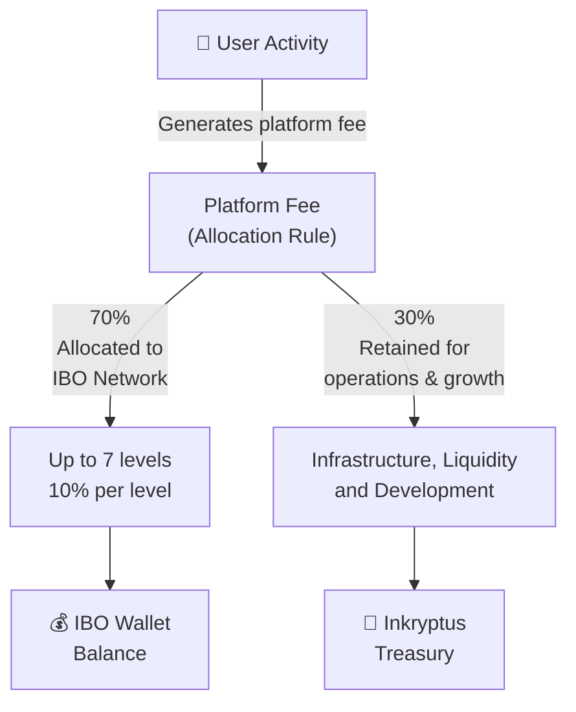

Commissions are the share of platform fees that Inkryptus redistributes to the Partner Program network. All commissions follow a **30% Inkryptus / 70% network** split, with the network share distributed as 10% per level across up to 7 levels.

When a level has no active sponsor, that level's 10% allocation is retained by Inkryptus.

## Distribution Model

| Split | Recipient | Purpose |
| --- | --- | --- |
| **30%** | Inkryptus | Platform operation, infrastructure, liquidity |
| **10%** | Level 1 | Direct sponsor |
| **10%** | Level 2 | Sponsor's sponsor |
| **10%** | Level 3 | Upline 2 |
| **10%** | Level 4 | Upline 3 |
| **10%** | Level 5 | Upline 4 |
| **10%** | Level 6 | Upline 5 |
| **10%** | Level 7 | Upline 6 |

This model applies uniformly to all fee types: subscription, transaction, performance, and Arena games. For details on each fee, see [Fees](/fees/index).

## Commission types

<Tabs>
  <Tab title="Subscription" icon="credit-card">
    The Partner Program subscription (US$24/month) is shared as follows:

    - **30%** (US$7.20) to Inkryptus
    - **70%** (US$16.80) across levels 1 to 7, **US$2.40 per level**

    ### Example: IBO with complete 7-level upline

    | Level | Recipient | % | Amount |
    | --- | --- | --- | --- |
    | 1 | You (direct sponsor) | 10% | US$2.40 |
    | 2 | Your upline | 10% | US$2.40 |
    | 3 | Upline 2 | 10% | US$2.40 |
    | 4 | Upline 3 | 10% | US$2.40 |
    | 5 | Upline 4 | 10% | US$2.40 |
    | 6 | Upline 5 | 10% | US$2.40 |
    | 7 | Upline 6 | 10% | US$2.40 |
    | -- | Inkryptus | 30% | US$7.20 |
  </Tab>

  <Tab title="Transaction" icon="repeat">
    Each Withdraw, Swap, or Harvest operation incurs a flat **US$3 fee**, converted to INKY at market rate.

    ### Example: US$3 fee equivalent to 100 INKY

    | Level | Recipient | % | Amount |
    | --- | --- | --- | --- |
    | 1 | You | 10% | 10 INKY |
    | 2 | Your upline | 10% | 10 INKY |
    | 3-7 | Uplines 2-6 | 10% each | 10 INKY each |
    | -- | Inkryptus | 30% | 30 INKY |
  </Tab>

  <Tab title="Performance" icon="trending-up">
    Staking and farming contracts generate daily profit. Inkryptus takes **25% of the daily profit** as a performance fee. The fee is then split across the network.

    - **25% of daily profit** = the performance fee
    - **75% of daily profit** goes to the user who staked

    ### Example: User earns 10 INKY profit in one day

    Performance fee = 2.5 INKY (25% of 10 INKY). User receives 7.5 INKY net.

    | Recipient | % | Amount | Notes |
    | --- | --- | --- | --- |
    | User | 75% of profit | 7.5 INKY | Net staking earnings |
    | Inkryptus | 30% of fee | 0.75 INKY | Platform |
    | Level 1 | 10% of fee | 0.25 INKY | Direct sponsor |
    | Levels 2-7 | 10% of fee each | 0.25 INKY each | Uplines |
  </Tab>

  <Tab title="Arena" icon="target">
    Inkryptus games (e.g., CoinFlip) embed a 10% fee into the multiplier. A win shows 1.9x (not 2x) because the fee is pre-deducted.

    ### Example: User wins 100 INKY bet at 1.9x multiplier

    Total payout to user = 190 INKY. Extracted fee = 10 INKY.

    | Recipient | Amount | Notes |
    | --- | --- | --- |
    | User | 190 INKY (1.9x) | Net payout |
    | Inkryptus | 3 INKY (30%) | Platform |
    | Level 1 | 1 INKY (10%) | Direct sponsor |
    | Levels 2-7 | 1 INKY each (10%) | Uplines |
  </Tab>
</Tabs>

## Payment Calendar

<Callout kind="info">
  All commissions are credited in **real time**, at the moment the user pays the fee. Performance commissions settle daily at 00:30 UTC because the performance fee itself is calculated daily.
</Callout>

## IBO Wallet Structure

Commissions are credited to the IBO Wallet, which is split into two sub-wallets:

| Sub-wallet | Receives | Transfer to User Wallet |
| --- | --- | --- |
| **Harvest** | Performance fee commissions | US$3 harvest fee per operation |
| **Transfer** | All other commissions (subscription, transaction, Arena) | No fee, immediate |

To use or withdraw IBO earnings, transfer from the IBO Wallet to the User Wallet first.

